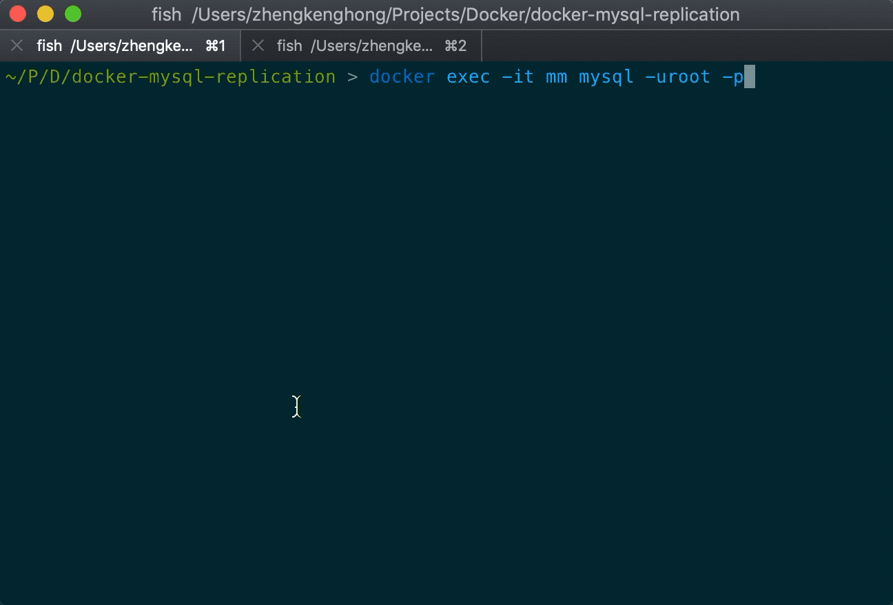

## docker-mysql-replication

This project is a minimal demo for setting up a mysql replication based on Docker.
The replication contains one master server and one slave server using the [GTID](https://dev.mysql.com/doc/refman/8.0/en/replication-gtids.html) method.



## setup procedure

1. Clone this repo.

2. [Download](https://www.docker.com/products/docker-desktop) and install Docker on your machine.

3. Download `mysql/mysql-server:8.0` image.
    ```
    $ docker pull mysql/mysql-server:8.0
    ```

4. Create a docker network for mysql servers.
    ```
    $ ./init-network.sh
    ```

5. Create folders for persisting data.
    ```
    $ mkdir master/data
    $ mkdir slave/data
    ```

6. Docker's mount path must be absolute, so update the path of your own.
    ```
    # master/init.sh
    --mount type=bind,src=../docker-mysql-replication/master/data,dst=/var/lib/mysql \
    --mount type=bind,src=../docker-mysql-replication/master/my.cnf,dst=/etc/my.cnf \

    # slave/init.sh
    --mount type=bind,src=../docker-mysql-replication/slave/data,dst=/var/lib/mysql \
    --mount type=bind,src=../docker-mysql-replication/slave/my.cnf,dst=/etc/my.cnf \
    ```

7. Start the master and slave server.
    ```
    ./master/init.sh
    ./slave/init.sh
    ```

8. Now two different mysql instances should be running on your machine. Check by
    ```
    $ docker ps

    CONTAINER ID        IMAGE                    COMMAND                  CREATED             STATUS                       PORTS                 NAMES
    5c32efe8fca2        mysql/mysql-server:8.0   "/entrypoint.sh mysq…"   About an hour ago   Up About an hour (healthy)   3306/tcp, 33060/tcp   ms
    c3bd30be30ac        mysql/mysql-server:8.0   "/entrypoint.sh mysq…"   About an hour ago   Up About an hour (healthy)   3306/tcp, 33060/tcp   mm
    ```

9. [Create an account](https://dev.mysql.com/doc/refman/8.0/en/replication-howto-repuser.html) for replication.
    ```
    # Login to the master. 'mm' is the docker container name coded in master/init.sh
    $ docker exec -it mm mysql -uroot -p
    $ root

    # create a replication account for slave to login
    mysql> CREATE USER 'repl'@'%' IDENTIFIED BY 'repl';
    mysql> GRANT REPLICATION SLAVE ON *.* TO 'repl'@'%';
    ```

10. Both two server join the network created on step 4. Check out the allocated ip of the master, so that the slave can connect to.
    ```
    $ docker inspect mm

    ...
    "Networks": {
        "mysql-cluster": {
            ...
            "IPAddress": "192.168.0.2",
            ...
        }
    }
    ```

11. Login to the slave server, and set up master config
    ```
    $ docker exec -it ms mysql -uroot -p
    $ root

    mysql> CHANGE MASTER TO
        >     MASTER_HOST = '192.168.0.2',
        >     MASTER_PORT = 3306,
        >     MASTER_USER = 'repl',
        >     MASTER_PASSWORD = 'repl',
        >     MASTER_AUTO_POSITION = 1;
    mysql> START SLAVE;
    ```

12. Done. No more steps. You can test the replication by create your first database now.


## refs

This demo is basically a minimal demo based on these documents. For more details or deeper explanations please read:

[mysql GTID replication](https://dev.mysql.com/doc/refman/8.0/en/replication-gtids.html)

[More Topics on Deploying MySQL Server with Docker](https://dev.mysql.com/doc/refman/8.0/en/docker-mysql-more-topics.html)

[docker mysql-server](https://hub.docker.com/r/mysql/mysql-server/)
